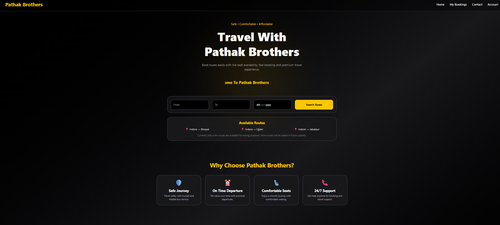
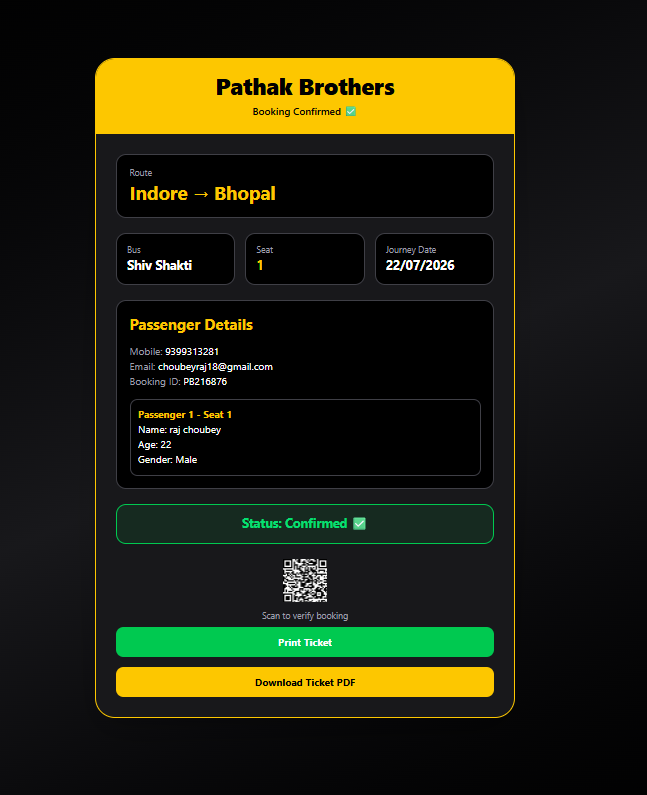
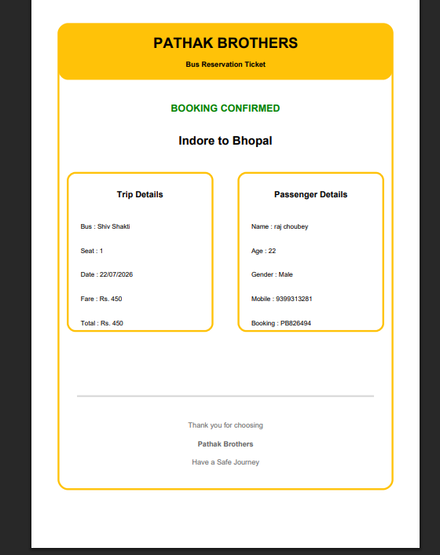

# 🚌 Pathak Brothers Bus Reservation System

<p align="center">
  <h3 align="center">Modern Full Stack Bus Reservation Platform</h3>
  <p align="center">
    Built using React • Node.js • Express.js • MongoDB
  </p>
</p>

---

## 🌐 Live Demo

👉 https://pathak-brothers-bus-reservation.netlify.app/

---

# 📖 About The Project

Pathak Brothers Bus Reservation System is a modern web application that allows users to search buses, select seats, enter passenger details, generate booking confirmation, and download a printable PDF ticket.

The project was developed to gain hands-on experience in Full Stack Web Development by building a real-world application.

---

# ✨ Features

- 🚌 Search Buses
- 📍 Select Route
- 💺 Interactive 2+3 Seat Layout
- 👤 Passenger Details
- 🎫 Booking Confirmation
- 📄 Download PDF Ticket
- 📱 Fully Responsive Design

---

# 🛠️ Tech Stack

## Frontend

- React
- JavaScript
- Tailwind CSS
- React Router

## Backend

- Node.js
- Express.js

## Database

- MongoDB

---

# 📸 Project Screenshots

## 🏠 Home Page



---

## 🚌 Bus Listing


---

## 💺 Seat Selection


---

## 🎫 Booking



---

## 📄 Ticket



---

# 🚀 Installation

```bash
git clone https://github.com/rajchoubey19/pathak-brothers-bus-reservation.git

cd pathak-brothers-bus-reservation

npm install

npm run dev
```

---

# 🎯 Future Improvements

- Online Payments
- Login & Registration
- Admin Dashboard
- Live Seat Availability
- Email Ticket
- Booking History

---

# 👨‍💻 Developer

**Raj Choubey**

B.Tech Computer Science Engineering Student

📧 Email:
choubeyraj18@gmail.com

💼 LinkedIn:
https://linkedin.com/in/rajchoubey

🌐 Live Demo:
https://pathak-brothers-bus-reservation.netlify.app/

---

# ⭐ Support

If you like this project, don't forget to give it a ⭐ on GitHub.

Thank you for visiting this repository.